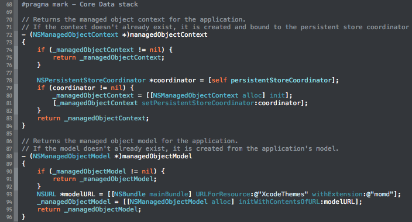
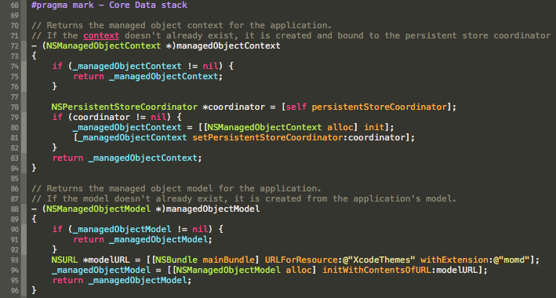
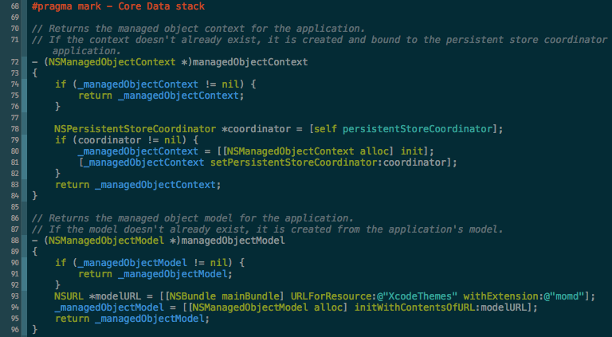
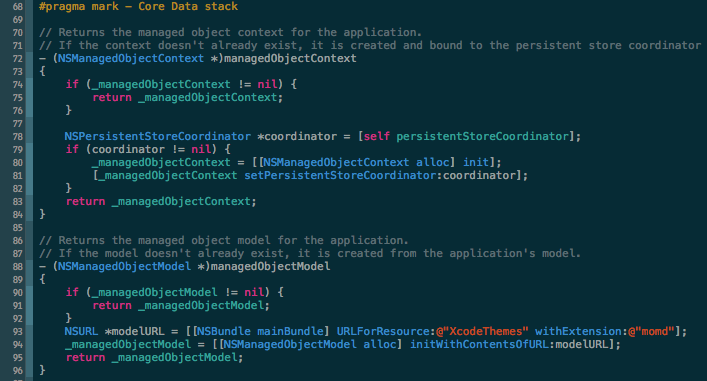
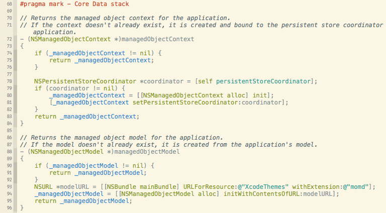

# Xcode Themes

This repository contains a collection of dark Xcode themes which lessen eyestrain. 

As a software developer you spend many hours coding. Having eye-friendly themes installed in your IDE is essential, especially if you like coding late at night.

## Installation

To install themse simply execute `install-themes.sh` [script][script].

[script]:https://github.com/michalkonturek/xcode-themes/blob/master/install-themes.sh

## Themes

### Flatland

### Monokai

### Solarized Dark

### Solarized Dark + MK

### Solarized Light

- - -

